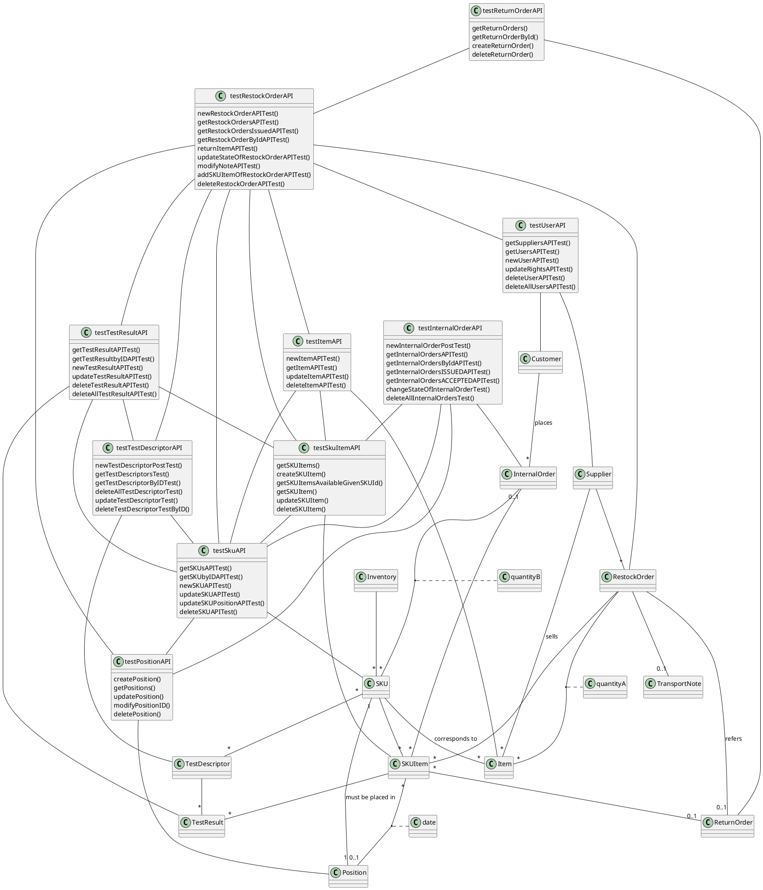

# Integration and API Test Report

Date: 25/05/2022

Version: final 

# Contents

- [Dependency graph](#dependency graph)

- [Integration approach](#integration)

- [Tests](#tests)

- [Scenarios](#scenarios)

- [Coverage of scenarios and FR](#scenario-coverage)
- [Coverage of non-functional requirements](#nfr-coverage)

# Dependency graph 

     <report the here the dependency graph of the classes in EzWH, using plantuml or other tool>
     

# Integration approach

    <Write here the integration sequence you adopted, in general terms (top down, bottom up, mixed) and as sequence
    (ex: step1: class A, step 2: class A+B, step 3: class A+B+C, etc)> 
    <Some steps may  correspond to unit testing (ex step1 in ex above), presented in other document UnitTestReport.md>
    <One step will  correspond to API testing>
    
We used a bottom-up approach; we started by testing the database-related functions reported in the DAO files. Once we ensured that they worked, we proceeded to test the API functions of the individual elements, starting with basic ones such as "Position" and ending with compound ones such as "RestockOrder"
For example testRestockOrder will thus take care of testing the class "RestockOrder" but also all the basic classes related to it such as "SKU"

#  Integration Tests

   <define below a table for each integration step. For each integration step report the group of classes under test, and the names of
     Jest test cases applied to them, and the mock ups used, if any> Jest test cases should be here code/server/unit_test

# API testing - Scenarios

<If needed, define here additional scenarios for the application. Scenarios should be named
 referring the UC in the OfficialRequirements that they detail>

No additional scenarios necessary

# Coverage of Scenarios and FR

<Report in the following table the coverage of  scenarios (from official requirements and from above) vs FR. 
Report also for each of the scenarios the (one or more) API Mocha tests that cover it. >  Mocha test cases should be here code/server/test

| Scenario ID | Functional Requirements covered | Mocha  Test(s) | 
| ----------- | ------------------------------- | ----------- | 
| 1-1 | FR2.1 | newSKUAPITest(), createPosition(), updateSKUPositionAPITest()|             
| 1-2     | FR2.1                        | updateSKUPositionAPITest()   |             
| 1-3       |    FR2.1                  |        updateSKUAPITest() |             
| 2-1       |      FR3.1.1           | createPosition()         |             
| 2-2         |        FR3.1.1 - FR3.1.4           |   updatePosition()          |             
| 2-3         |          FR3.1.1  -  FR3.1.4   |      updatePosition()       |  
| 2-4         |        FR3.1.1    -  FR3.1.4         |      updatePosition()       |  
| 2-5         |                 FR3.1.2                |     deletePosition()       |             
| 3-2         |        FR5.6                    |    newRestockOrderAPITest()   |  
| 4-1         |       FR4.1                          |   newUserAPITest()    |  
| 4-2        |            FR4.1                    |      updateRightsAPITest()       |  
| 4-3       |             FR4.2                    |     deleteUserAPITest()        |  
| 5-1-1        |        FR5.2            |   updateStateOfRestockOrderAPITest(), addSKUItemOfRestockOrderAPITest() |  
| 5-2-1         |        FR3.2      - FR5  |    updateStateOfRestockOrderAPITest() , newTestResultAPITest() |  
| 5-2-2       |               FR3.2  - FR5        |   updateStateOfRestockOrderAPITest(). newTestResultAPITest()     |  
| 5-2-3        |            FR3.2 - FR5  |  updateStateOfRestockOrderAPITest(), newTestResultAPITest()         |  
| 5-3-1        |           FR5.7     |   updateStateOfRestockOrderAPITest(), updateSkuPosition()       |  
| 5-3-2         |    FR5.7       |  updateStateOfRestockOrderAPITest()  |  
| 5-3-3      |       FR5.7           | updateStateOfRestockOrderAPITest(), updateSkuPosition()   |  
| 6-1         |      FR5.9       | createReturnOrder()    |  
| 6-2        |   FR5.11   |    updateSKUAPITest(), updateSKUItem()  |  
| 9-1         | FR6.1 - FR6.2 - FR6.3 - FR6.5 - FR6.6 |  newSKUAPITest(), createPosition(), updateSKUPositionAPITest(), newInternalOrderPostTest() |  
| 9-2        |   FR6.6 - FR6.7  |    changeStateOfInternalOrderTest()   |  
| 9-3        |    FR6.6 - FR6.7  |  changeStateOfInternalOrderTest()           |  
| 10-1       |  FR6.7  |   changeStateOfInternalOrderTest()    |  
| 11-1         |     FR7     |  newItemAPITest()    |  
| 11-2         |        FR7     |  updateItemAPITest()  |  
| 12-1        |     FR3.2.1      |     newTestDescriptorPostTest()        |  
| 12-2         |      FR3.2.2    |   updateTestDescriptorTest()   |  
| 12-3         |       FR3.2.3          |  deleteTestDescriptorTestByID()     |

# Coverage of Non Functional Requirements

<Report in the following table the coverage of the Non Functional Requirements of the application - only those that can be tested with automated testing frameworks.>

### 

| Non Functional Requirement | Test name | Note |
| -------------------------- | --------- | -------------------------- |
| NFR4  (Domain)            |  createPosition() | position ID is the unique identifier of a position, 12 digits
| NFR5  (Domain)            |  newSKUAPITest() | SKU.ID is an integer (with reference API.md)
| NFR6  (Domain)            |  createSKUItem() | RFID is a string of 32 digits
| NFR7  (Domain)            |  createPosition() | Position Volume is an integer which represents cube meters
| NFR8  (Domain)            |  createPosition() | Position Weight is an integer which represents kilograms

