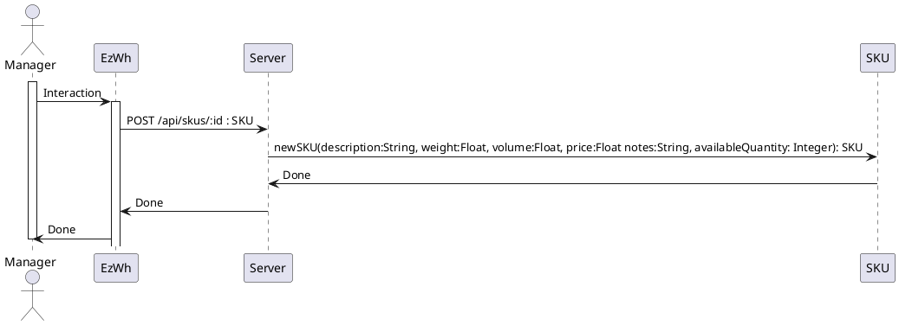
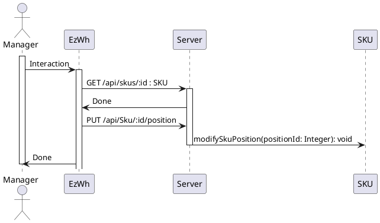
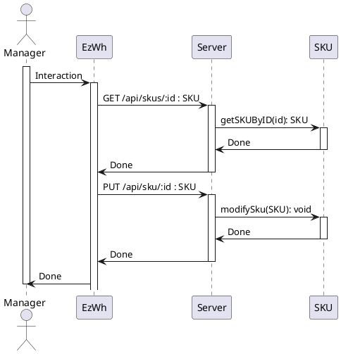
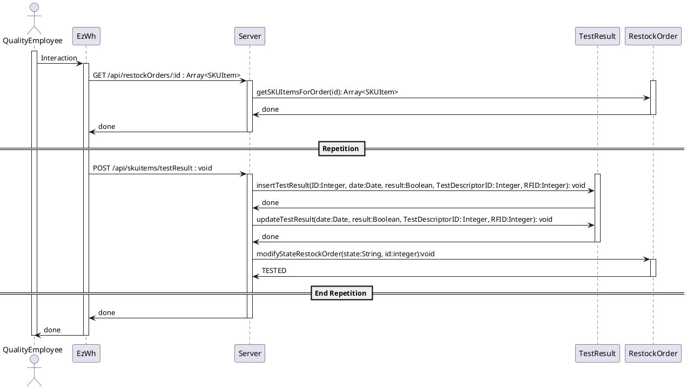
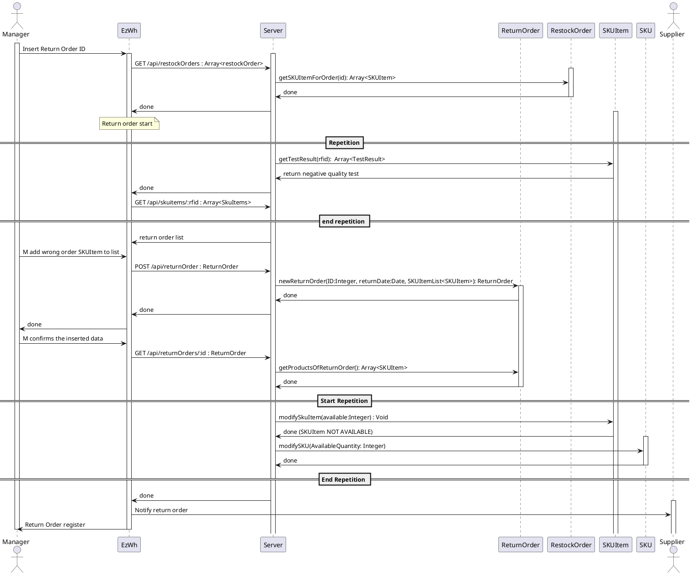
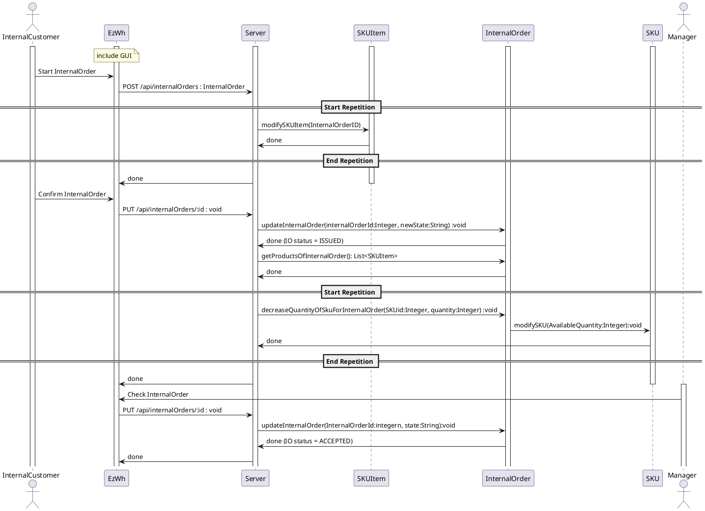
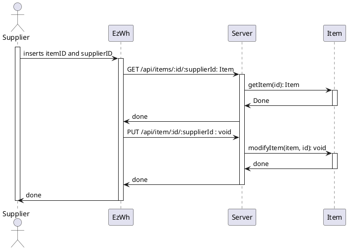

# Design Document     
 
 
Authors: Castelli Gabriele, Chessa Marco, Mallemaci Salvatore, Vacchetto Paolo
 
Date: 22/06/2022
 
Version: 2.2
 
 
# Contents
 
- [High level design](#package-diagram)
- [Low level design](#class-diagram)
- [Verification traceability matrix](#verification-traceability-matrix)
- [Verification sequence diagrams](#verification-sequence-diagrams)
 
# Instructions
 
The design must satisfy the Official Requirements document, notably functional and non functional requirements, and be consistent with the APIs
 
# High level design 
 
Ezwh is a layered application and consists of one executable generating one single process and thread. Our application is composed of the following packages: 
data, for managing and processing data( this package implements the “model” data of the MVC architectural part. This Package contains the data processing functions and the class structure) 
Gui, implements the Graphical User Interface
 
We use a MVC pattern: 
The Ezwh application can modify data and after the updates the views must change. Datas are stored in a database, so it is better to separate the layers in which dates are handled. 
 
 
The system is organized in a set of layers to get modularity. Each layer provides services for the layer below and above. In this way, when a layer interface changes, only the adjacent layer is affected.  
 
 
 
# Low level design

```plantuml

@startuml

Server --> Item
Server --> Position
Server --> InternalOrder
Server --> SKU
Server --> SKUItem
Server --> RestockOrder
Server --> ReturnOrder
Server --> Account
Server --> TestResult
SKU --> SKUItem
SKU --> Item
SKU --> Position
SKU --> TestDescriptor
SKUItem --> Position
InternalOrder --> SKUItem
InternalOrder --> SKU
RestockOrder --> SKUItem
RestockOrder --> Item
RestockOrder --> ReturnOrder
RestockOrder --> TransportNote
ReturnOrder --> SKUItem
TestResult --> SKUItem
TestResult --> TestDescriptor

Class Server{

    --SKU--
    + **GET** /api/skus : Array<SKU>
    + **GET** /api/skus/:id : SKU
    + **POST** /api/skus/:id : void
    + **PUT** /api/sku/:id : void
    + **DELETE** /api/skus/:id : void
    + **DELETE** /api/skus/deleteAll : void

    --SKUItems--
    + **GET** /api/skuitems : Array<SKUItem>
    + **GET** /api/skuitems/sku/:id : Array<SKUItem>
    + **GET** /api/skuitems/:rfid : SKUItem
    + **POST** /api/skuitem : void
    + **PUT** /api/skuitems/:rfid : void
    + **DELETE** /api/skuitems/:rfid: void
    + **DELETE** /api/skus/deleteSKUitems : void

    --Position--
    + **GET** /api/positions : Array<position>
    + **POST** /api/position : void
    + **PUT** /api/position/:positionID : void
    + **PUT** /api/position/:positionID/changeID : void
    + **DELETE** /api/position/:positionID : void
    + **DELETE** /api/deletePositions : void

    --Item--
    + **GET** /api/items : Array<Item>
    + **GET** /api/item/:id/:supplierId : Item
    + **POST** /api/item : void
    + **PUT** /api/item/:id/:supplierId : void
    + **DELETE** /api/item/:id/:supplierId : void
    + **DELETE** /api/items/deleteAll : void

    --ORDERS--
    --RestockOrders--
    + **GET** /api/restockOrders: Array<RestockOrder>
    + **GET** /api/restockOrdersIssued: Array<RestockOrder>
    + **GET** /api/restockOrders/:id: Array<RestockOrder>
    + **GET** /api/restockOrders/:id/returnItems: Array<RestockOrder>
    + **POST** /api/restockOrder: void
    + **PUT** /api/restockOrder/:id: void
    + **PUT** /api/restockOrder/:id/skuItems: void
    + **PUT** /api/restockOrder/:id/transportNote: void
    + **DELETE** /api/restockOrder/:id: void 
    + **DELETE** /api/restockOrders/allRestockOrders: void
    + **DELETE** /api/restockOrder_Item/allRestockOrder_Item: void



    --ReturnOrder--
    + **GET**  /api/returnOrders/:id: Array<ReturnOrder>
    + **GET** /api/returnOrders:  Array<ReturnOrder>
    + **POST**  /api/returnOrder: void
    + **DELETE** /api/returnOrder/:id: void
    + **DELETE** /api/deleteReturnOrders: void

    --InternalOrder--
    + **GET** /api/internalOrders : Array<internalOrder>
    + **GET** /api/internalOrdersIssued :  Array<internalOrdersIssued>
    + **GET** /api/internalOrdersAccepted :  Array<internalOrdersAccepted>
    + **GET** /api/internalOrders/:id:  Array<internalOrdersAccepted>
    + **POST** /api/internalOrders : void
    + **PUT** /api/internalOrders/:id : void
    + **DELETE** /api/internalOrders/:id : void
    + **DELETE** /api/deleteAllInternalOrders : void

    --Account--
    + **GET** /api/suppliers : Array<suppliers>
    + **GET** /api/users :  Array<users>
    + **POST** /api/newUser : void
    + **PUT** /api/users/:username : void
    + **DELETE** /api/users/:username/:type : void
    + **DELETE** /api/users/allUsers : void

    --TestResult--
    + **GET** /api/skuitems/:rfid/testResults : Array<TestResult>
    + **GET** /api/skuitems/:rfid/testResults/:id Array<TestResult>
    + **POST** /api/skuitems/testResult : void
    + **PUT** /api/skuitems/:rfid/testResult/:id : void
    + **DELETE** /api/skuitems/:rfid/testResult/:id : void
    + **DELETE** /api/testResult/deleteAll : void

    --TestDescriptor--
    + **GET** /api/testDescriptors : Array<testDescriptors>
    + **GET** /api/testDescriptors/:id :  testDescriptor
    + **POST** /api/testDescriptor : void
    + **PUT** /api/testDescriptor/:id : void
    + **DELETE** /api/testDescriptor/:id : void
    + **DELETE** /api/deleteTestDescriptors : void
}

 Class Account{
    - ID: Integer
    - Name: String
    - Surname: String
    - AccessRight: Integer
    - Email: String
    - Password: String
    + getStoredSuppliers():  Array<suppliers>
    + getStoredUsers(): Array<user>
    + getAllUsers(): Array<user>
    + getUserbyUsername(username): user
    + getUserbyUsernameAndType(username,type): user
    + newUser(data): void
    + updateRights(username): Void
    + deleteUser(username, type): Void
    + deleteAllUsers(): Void
}

Class SKU{
    - ID: Integer
    - Description: String
    - Weight: Integer
    - Volume: Float
    - Price: Float
    - Notes: String
    - availableQuantity: Integer
    - positionId: Integer
    + getStoredSKUS(): Array<SKU>
    + getSKUbyID(id): Array<SKU>
    + newSKU(SKU)siummm: void
    + modifySku(SKU): void
    + modifySkuPosition(SKU): void
    + deletePositionSKU(positionId, quantity): void
    + deleteSKU(id): void
    + deleteAllSKUs(): void
    + getLastSKU(): Array<SKU> 
}

Class SKUItem{
    - SKUID: Integer
    - RFID: Integer
    - Available: Integer
    - DateofStock: Date
    - TestResultMap:Map<Integer,TestResult>
    - PositionID: Integer
    +getSKUItems() : Array<SKUItem>
    +getSKUItemsBySKUID(SKUId) : Array<SKUItem>
    +getSKUItemsByRFID(Rfid) : Array<SKUItem>
    +newSKUItem(data) : void
    +modifySkuItem(data) : void
    +deleteSKUItem(rfid) : void
    +deleteAllSKUItem() :void
}

Class TestResult{
    - ID: Integer
    - Date: Date
    - result: Boolean
    - testNumber: Integer
    - TestDescriptorID: Integer
    - RFID:Integer
    + getTestResults(rfid) : Array<TestResult>
    + getTestResult(data) : Array<TestResult>
    + insertTestResult(data) : void
    + updateTestResult(data) : void
}

Class Item{
    - ID: Integer
    - Description: String
    - Price: Float
    - SupplierID:Integer
    + getItems(): Array<Item>
    + getItemBySKUID(SKUID): Array<Item>
    + getItem(id): Array<Item>
    + getLastIdOfItem(): Array<Item>
    + getSupplierforSkuIdOrId(supplierId, itemId, SkuId): Array<RestockOrder>
    + createItem(Item): void
    + createItemOfRestockOrder(item, itemId, supplierId): void
    + modifyItem(item, id): void
    + deleteItem(id): void
    + deleteAllItems(): void
}

Class InternalOrder{
    - ID:Integer
    - Date:date
    - CustomerID:Integer
    - SKUItemList:List<SKUItem>
    - From:String
    - State:String
    - Quantity:Integer
    +getInternalOrders() : Array<InternalOrders>
    +getInternalOrders_SKU() : Array<InternalOrders_SKU>
    +getInternalById(internalOrderId) : InternalOrder
    +getInternalOrderByState(state) : Array<InternalOrder>
    +getProductsOfInternalOrder() : Array<ProductsOfInternalOrder>
    +getProductsOfInternalOrderCompleted() : Array<ProductsOfInternalOrderCompleted>
    +newInternalOrder(data) : Void
    +checkAvailabilityOfSkuForInternalOrder(SKUId) : Integer
    +getLastIdOfInternalOrders() : Integer
    +newInternalOrder_SKU(internalOrderId, SKUID, quantity) : void
    +decreaseQuantityOfSKUForInternalOrder(SKUId, quantity) : void
    +increaseQuantityOfSKUForInternalOrder(SKUId, quantity) : void
    +getPositionIdBySKUid(SKUid) :Integer
    +decreasePositionInternalOrder(positionId, quantity) : void
    +increasePositionInternalOrder(positionId, quantity) : void
    +updateInternalOrder(internalOrderId, newState) : void
    +updateInternalOrderOfSKUItem(SkuID, RFID, InternalOrderId) : void
    +deleteInternalOrder(id) : void
    +deleteInternalOrder_SKU(internalOrderId) : void
    +deleteInternalOrder_SKUITEM(internalOrderId) : void
    +deleteAllInternalOrders() : void 
    +deleteAllInternalOrders_SKU() : void 
    +deleteAllSkuItem() : void 
    +updateSkuItemForInternalOrder(RFID, internalOrderId) : void

   
}

Class RestockOrder{
    - RestockOrderID:Integer
    - issueDate:Date
    - State: Integer
    - SKUItemList:List<SKUItem>
    - Quantity:Integer
    - AccountId: Integer
    - transportNote:TransportNote
    + getRestockOrders(): Array<RestockOrder>
    + getProducts(): Array<products>
    + getSKUItemsForOrder(id): Array<SKUItem> 
    + getRestockOrdersIssued(): Array<RestockOrder>
    + getRestockOrder(id): Array<RestockOrder>
    + returnItem(id): Array<Item>
    + createRestockOrder(order): void
    + lastOrder(): Integer
    + getSKUForRestockOrder(restockOrderId): Array<SKU>
    + newRestockOrder_Item(id, itemId, qty): void
    + modifyStateRestockOrder(state, id): void
    + modifyNote(note, id): void
    + deleteRestockOrder(id): void
    + deleteRestockOrder_Item(id): void
    + updateSKUITEM_available(RFID, id, available): void
    + deleteAllRestockOrders(): void
    + deleteAllRestockOrder_Item(): void
   
}

Class Position{
    - positionID: Integer
    - AisleID: Integer
    - Row: Integer
    - Col: Integer
    - maxWeight: Float
    - maxVolume: Float
    - occupiedWeight: Float
    - occupiedVolume: Float
    + getPositions():Array<Position>
    + getPositionByID(data):Array<Position>
    +updatePosition(data):void
    +modifyStorePosition(data):void
    +insertPosition(data):void
    +deletePosition(data):void
    +deleteAllPositions():void
}

Class ReturnOrder {
    - ID: Integer
    - returnDate: Date
    - SKUItemList:List<SKUItem>
    - ROID: Integer
    +getReturnOrders():Array<ReturnOrder>
    +getProductsOfReturnOrder():Array<ReturnOrder>
    +getReturnOrderById(returnOrderID):Array<ReturnOrder>
    +newReturnOrder(data):void
    +getLastIdOfReturnOrders():Array<ReturnOrder>
    +updateReturnOrderIdOfSKUItem(SkuID, RFID, returnOrderId):Array<ReturnOrder>
    +deleteReturnOrder(id):void
    +deleteReturnOrder_SKUITEM(returnOrderId):void
    +deleteAllReturnOrders():void
}
Class TestDescriptor {
    - ID: Integer
    - Name: String
    - procedureDescription: String
    - SKUID: Integer
    + getTestDescriptors():Array<TestDescriptor>
    +getTestDescriptorByID(id):Array<TestDescriptor>
    +newTestDescriptor(data):void
    +modifyTestDescriptor(data):void
    +deleteTestDescriptor(id):void
    +deleteAllTestDescriptor():void
}


@enduml



```

# Verification traceability matrix
 
|     | Server | Account |  SKU  | SKUitem | TestResult | Item  | InternalOrder | RestockOrder | Position | ReturnOrder | TestDescriptor |
| --- | :----: | :-----: | :---: | :-----: | :--------: | :---: | :-----------: | :----------: | :------: | :---------: | :------------: |
| FR1 |   x    |    x    |       |         |            |       |               |              |          |             |                |
| FR2 |   x    |         |   x   |         |            |       |               |              |          |             |                |
| FR3 |   x    |         |       |         |     x      |       |               |              |    x     |             |       x        |
| FR4 |   x    |    x    |       |         |            |       |               |              |          |             |                |
| FR5 |   x    |    x    |   x   |    x    |            |   x   |               |      x       |          |      x      |                |
| FR6 |   x    |         |       |    x    |            |       |       x       |              |          |             |                |
| FR7 |   x    |         |       |    x    |            |   x   |               |              |          |             |       x        |

 
 
# Verification sequence diagrams
\<select key scenarios from the requirement document. For each of them define a sequence diagram showing that the scenario can be implemented by the classes and methods in the design>

## Sequence diagram of use case 1, UC1
Create SKU (Scenario 1.1)

## Sequence diagram of use case 1, UC1
 Modify SKU location (Scenario 1.2)

## Sequence diagram of use case 1, UC1
Modify SKU parameters (Scenario 1.3)

## Sequence diagram of use case 5, UC5
Manage testing of SKU Items of a restock Order (Scenario 5.2)

##  Sequence diagram of use case 6, UC6
Manage return order of SKU items

## Sequence diagram of use case 9, UC9.1
Manage internal orders creation and acceptance

## Sequence diagram of use case 11, UC11
Manage Items (Scenario 11.1)

