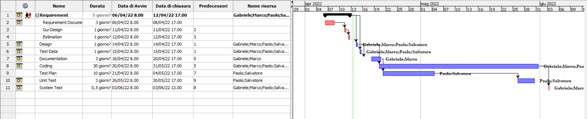

# Project Estimation  
Date: 12/04

Version: 1.0

# Estimation approach
Consider the EZWH  project as described in YOUR requirement document, assume that you are going to develop the project INDEPENDENT of the deadlines of the course
# Estimate by size
### 
|             | Estimate                        |             
| ----------- | ------------------------------- |  
| NC =  Estimated number of classes to be developed   |        40         |             
|  A = Estimated average size per class, in LOC       |           375              | 
| S = Estimated size of project, in LOC (= NC * A) | 15000 |
| E = Estimated effort, in person hours (here use productivity 10 LOC per person hour)  |  1500 |                      
| C = Estimated cost, in euro (here use 1 person hour cost = 30 euro) | 45000 | 
| Estimated calendar time, in calendar weeks (Assume team of 4 people, 8 hours per day, 5 days per week ) | 10 |               

# Estimate by product decomposition
### 
|         component name    | Estimated effort (person hours)   |             
| ----------- | ------------------------------- | 
|requirement document    | 50 |
| GUI prototype | 20 |
|design document | 20 |
|code | 960 |
| unit tests | 160 |
| api tests |160 |
| management documents  | 50 |

# Estimate by activity decomposition
### 
|         Activity name    | Estimated effort (person hours)   |             
| ----------- | ------------------------------- | 
| Requirements | 65 |
| Design | 20 |
| Test Data | 20 |
| Documentation | 40 |
|Coding | 960 |
| Test Plan | 150 |
| Unit Test | 150 |
| System Test | 60 |

###

# Summary

Report here the results of the three estimation approaches. The  estimates may differ. Discuss here the possible reasons for the difference

|             | Estimated effort                        |   Estimated duration |          
| ----------- | ------------------------------- | ---------------|
|| estimate by size |1500|
|| estimate by product decomposition |1420 |
|| estimate by activity decomposition |1465|

