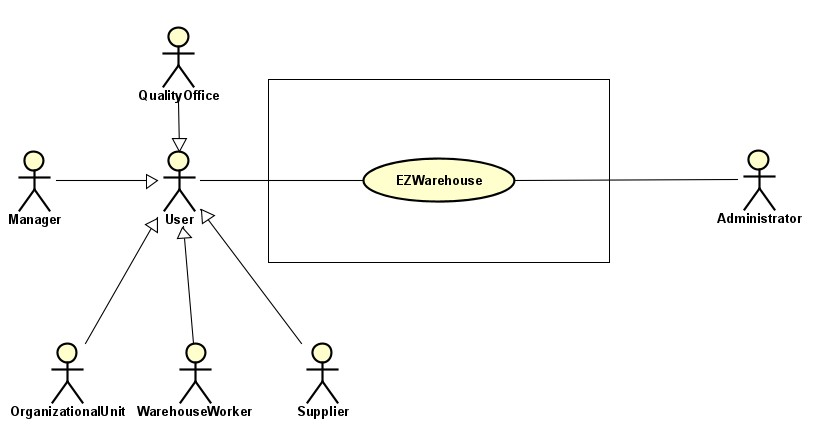
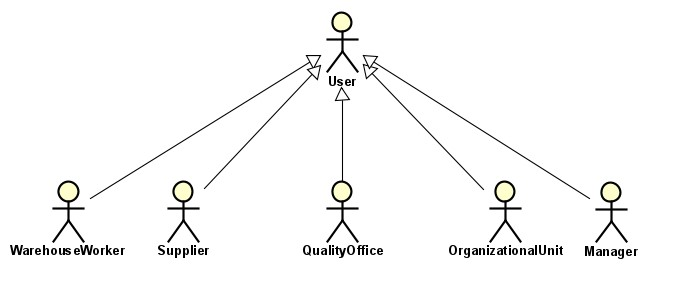
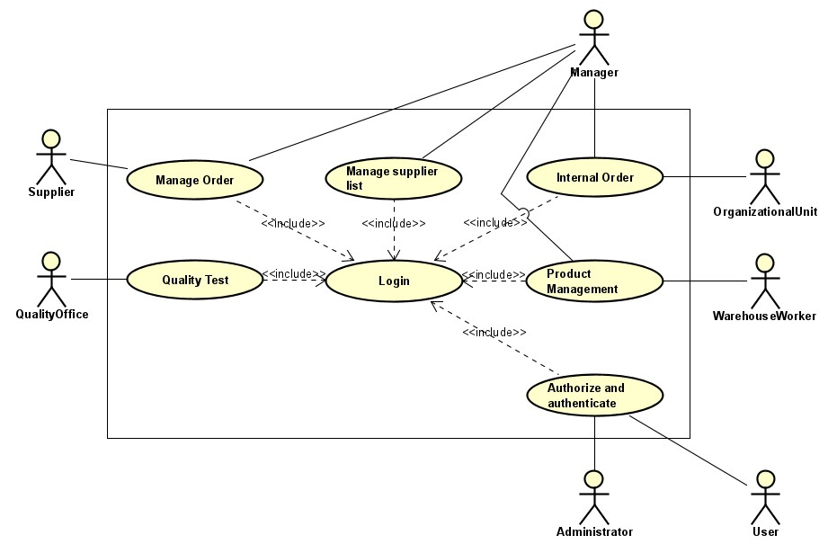
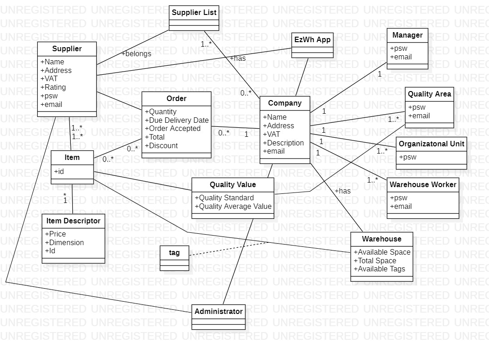
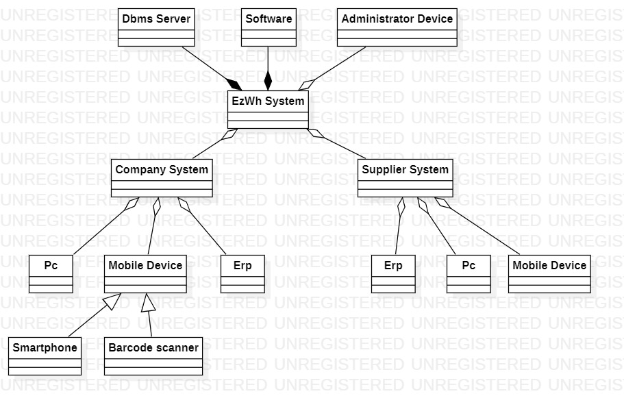
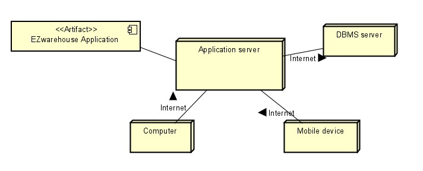

# Stakeholders
 
 
| Stakeholder name  | Description | 
| ----------------- |:-----------:|
|   (Medium) Company     | Company that has a warehouse and need an application to manage inventory and the warehouse | 
|   Retailer     |  Retailer that has a warehouse and need an application to manage inventory and the warehouse   | 
|   Supplier     | Supplier is an economic entity that operates in the procurement market for financial and primary resources (goods and services)  | 
|   Manager     | Who supervises the warehouse | 
|   Administrator     | Who supervises the application |
|   Quality Office  | Who applies specific tests for item to guarantee quality     |
|   Organizational Unit | Internal unit (of the company) that has internal connection with the warehouse |
|   Accounting  | Organizational unit for recording economic transactions, such as income and expenses, relevant to the company. | 
|  Company Owner | A person/organization that leads the company |
|  Financer  | A person/company that is interested in the outcoming of the app and finances it |
|  Competitor | Rival organization that works in the same working environment |
|  Browser | Where the service is distributed and it is available to companies |
|  Cloud Service for operation | Has the purpose of data storage, processing, or transmission. Starting with a set of resources remotely in the form of a distributed architecture.|

 
# Context Diagram and interfaces
 
## Context Diagram

 
## Interfaces

 
| Actor | Logical Interface | Physical Interface  |
| ------------- |:-------------:| -----:|
|  Supplier    | Web Gui | Screen keyboard mouse on PC, touchscreen on smart device |
|   Retailer     | Web Gui | Screen keyboard mouse on PC, touchscreen on smartphone  |
|   Manager     | Web Gui |  Screen keyboard mouse on PC, touchscreen on smartphone |
|   Administrator     | Web Gui |  Screen keyboard mouse on PC, touchscreen on smartphone |
|   Warehouse worker    | App Interface | Handheld device |
|   Quality Office     | Web Gui | PC, Test Device|
|   Organizational Unit     | Web Gui | Screen keyboard mouse on PC, touchscreen on smartphone |
 
# Stories and personas

 
Fabio is 55, he is a manager and owns a chain of coffee shops. For his shops he needs to have only the best ingredients and has to deal with different suppliers in order to bring to his customer the best quality. It is also important for him to always have an up to date warehouse. It’s mandatory to have at least some stocks in the warehouse. He uses the EzWh app to emit new orders and to check the status of stocks.  
 
Antonio is 45, owns a company that produces custom components for cars. His most important clients are car workshops and private customers. His customers use the EzWh app to emit orders. Thanks to the app he can deal with all the orders without any kind of confusion so he can focus on making custom components.   
 
Andrea is 40, he works in a quality office in a medium Company and he has three children. He is very fussy in his life and job. He has a bad temper, so he needs an user-friendly application to work with. 
Is in charge of recording all tests performed and their outcomes. He generates statistics on the number of passed and failed tests of each supplier. In the case of a failed test, he deals with the practice of returning the goods.
 
Maria is 28, she is a retailer in a family company. She works accurately with her family to create luxury carpet. She is really selective in choosing her business partners and would like an easy way to get in touch with the products needed for her company. 
 
Enzo is 32, he works in an IT company. Sometimes it happens that customers or internal employees need hardware (like a usb flash drive or mouse/ keyboard). This kind of need doesn't matter to the Manager who is always busy dealing with customers. In order to not bother him he uses the EzWh app to update the warehouse (if he takes hw from the warehouse) or to emit an order to a specific supplier. If the quality office requires it, bring the products to the testing phase.
 
 
 
 
# Functional and non functional requirements
 
## Functional Requirements
 
\<In the form DO SOMETHING, or VERB NOUN, describe high level capabilities of the system>
 
\<they match to high level use cases>
 
| ID        | Description  |
| ------------- |:-------------:| 
|  **FR1**     |  **Product Management**  |
|  FR1.1     |  Return item availability |
|  FR1.2     |  Update item availability |
|  FR1.3     |  Notify low availability |
|  FR1.4     |  Set department(via tag) |
|  **FR2**     | **Manage Order** |
|  FR2.1     | Create an Order  |
|  FR2.2     | Modify an Order  |
|  FR2.3     | Delete an Order  |
|  FR2.4     | View orders  |
| **FR3**   | **Authorize and authenticate** |
| FR3.1  |  Create an Account | 
| FR3.2  |  Delete an Account |
| FR3.3  |  Modify an Account |
| FR3.4  |  Log in |
| FR3.5  |  Log out | 
| FR3.6  |  Change password  | 
| **FR4** | **Quality Test** |
| FR4.1 | Insertion of test result |
| FR4.2 | Inserting the practice of restitution to the supplier |
| FR4.3 | Update test statistics |
| FR4.4 | View test statistics |
| **FR5** | **Manage supplier list** |
| FR5.1 | Create a supplier list for an item  |
| FR5.2 |  Modify a supplier list for an item |
| FR5.3 | Delete a supplier list for an item |
|  **FR6**   | **Internal Order** |
|  FR6.1     | Create an Internal Order  |
|  FR6.2     | Modify an Internal Order  |
|  FR6.3     |  Deliver product to pick up area |a
|  FR6.4     |  Set order ready to deliver |a
|  FR6.5     | Complete an Internal Order (order retired)|
|  FR7    | **Supplier** |
|  FR7.1     | View pending orders |
|  FR7.2     | Submit an Order |
|  FR7.3     | Manage orders |
 
 
 
 

 
## Non Functional Requirements

 
| ID        | Type (efficiency, reliability, ..)           | Description  | Refers to |
| ------------- |:-------------:| :-----:| -----:|
|  NFR1     | Usability  | Application should be used with no specific training for the users | |
 Access right, actor vs function|  NFR2     | Reliability | Consistency between goods and inventory |  |
|  NFR3     | Privacy | The data of one order should not be disclosed to other suppliers. | |
|  NFR4     | Portability |  The application should be accessed by Chrome (version 81 and more recent), and Safari (version 13 and more recent) (this covers around 80% of installed browsers); and from the operating systems where these browsers are available (Android, IoS, Windows, MacOS, Unix). As for devices, the application should be usable on smartphones (portrait) and PCs (landscape). | |
|  NFR5     | Performance  | Response time should be less than 0.5 seconds | |
|  NFR6     | Space  | The number of items can’t go under/over a certain threshold| |
|  NFR7     | Safety | Absence of dangerous situations for persons | | 
 
 
# Use case diagram and use cases

 
## Use case diagram
\<define here UML Use case diagram UCD summarizing all use cases, and their relationships>

 
\<next describe here each use case in the UCD>
### Use case 0, UC0 - Create an order
| Actors Involved        | Manager|
| ------------- |:-------------:| 
|  Precondition     | Manager is authenticated |
|      | Supplier exists in supplier list |
|      | The warehouse is not full |
|  Post condition     | Order added to the system |
|  Nominal Scenario     | Manager chooses a supplier from the list  |
|      | Manager inputs an order |
|  Variants     |  |
##### Scenario 0.1 
 
\<describe here scenarios instances of UC1>
 
\<a scenario is a sequence of steps that corresponds to a particular execution of one use case>
 
\<a scenario is a more formal description of a story>
 
\<only relevant scenarios should be described>
 
| Scenario 0.1 | |
| ------------- |:-------------:| 
|  Precondition     | Manager is authenticated |
|      | Supplier exists in supplier list |
|      | The warehouse is not full |
|  Post condition     | Order emitted and added to the system |
| Step#        | Description  |
|  1     | The manager picks a supplier from the list. |  
|  2     | The manager inserts types of products on which to place the order , indicating quantity to the supplier |
|   3   | System verify WHspace_avaiable >= order_quantity|
|  4    |  Supplier verifies order availability |
|    5  | Supplier responds with delivery date |

 
### Use case 1, UC1 - Accept an order
| Actors Involved        | Supplier |
| ------------- |:-------------:| 
|  Precondition     | Supplier is authenticated |
|  Post condition     | Order approved|
|  Nominal Scenario     | Supplier receives an order |
|      | Supplier checks order availability  |
|      | Supplier responds with delivery date |
|  Variants     |  |
|  Exceptions     | Supplier hasn’t product -> Order canceled |
 
 
 
### Use case 2, UC2 - Modify an Order
 
| Actors Involved        | Manager |
| ------------- |:-------------:| 
|  Precondition     | Manager is authenticated |
|      | Order already exists |
|  Post condition   | Order details updated in the system |
|  Nominal Scenario     | Manager modifies the order details |
|  Exceptions     | It’s too late for the update  -> edit of the order denied |
 
 
 

 

### Use case 3, UC3 - Delete an Order
 
| Actors Involved        | Manager |
| ------------- |:-------------:| 
|  Precondition     | Manager is authenticated |
|      | Order already exists |
|  Post condition   | Order deleted |
|  Nominal Scenario     | Manager requests the deletion of the order |
|  Variants     |  |
|  Exceptions     | It’s too late for the deletion -> deletion of the order denied |

### Use case 4, UC4 - View Orders
 
| Actors Involved        | Manager |
| ------------- |:-------------:| 
|  Precondition     | Manager is authenticated |
|      | An Order already exists |
|  Nominal Scenario     | Manager visualizes a list of orders |
|  Variants     |  The Manager visualizes a list of orders an he can filter an order based on a code |
|  Variants     | The Manager visualizes a list of orders an he can visualize completed orders|
 

### Use case 5 , UC5 - Return item availability
| Actors Involved        | Manager  |
| ------------- |:-------------:|
|  Precondition     | The manager is authenticated |
|  Post condition     | The system returns the item availability  |
|  Nominal Scenario     | The manager selects an item and requests its availability in the warehouse  |
|  Exceptions     | The manager selects an item that is not in the warehouse. A warning is showed  |

 
 

 ### Use case 6, UC6 - Notify low availability
| Actors Involved        | Manager  |
| ------------- |:-------------:|
|  Precondition     | The manager is authenticated |
|      | Item is under a certain threshold |
|  Post condition     | The manager creates a new order  |
|  Nominal Scenario     | the system notifies to the manager that an item is below the threshold. |

 

 ### Use case 7, UC7 - Set department(via tag) and Update warehouse
| Actors Involved        | Warehouse worker  |
| ------------- |:-------------:|
|  Precondition     | An order has been completed and received. |
|      | The warehouse worker is authenticated |
|| The products have passed the quality tests|
|  Post condition     |  The position of the order is stored in the system |
|   |  The quantity on the item is updated |
|  Nominal Scenario     | The warehouse worker inserts(via tag) the position of the order in the warehouse |
|     | The system automatically update the quantity values in the database |

 

### Use case 8, UC8 - Create a supplier list for an item
| Actors Involved        | Manager  |
| ------------- |:-------------:|
|  Precondition     | Manager is authenticated |
|  Post condition     |  The list is created for that item |
|  Nominal Scenario     | The manager creates a list of suppliers for a item |
|  Variants     | The manager creates a list but it already exists for that item |

 

### Use case 9, UC9 - Modify a supplier list for an item
| Actors Involved        | Manager  |
| ------------- |:-------------:|
|  Precondition     | A list exists for that item|
|      | Manager is authenticated |
|  Post condition     |  The list is updated for that item |
|  Nominal Scenario     | The manager selects a list. The manager modify the list of suppliers for an item |

 

### Use case 10, UC10 - Delete a supplier list for an item
| Actors Involved        | Manager  |
| ------------- |:-------------:|
|  Precondition     | A list exists for that item|
|      | Manager is authenticated |
|  Post condition     |  The list is updated for that item |
|  Nominal Scenario     | The manager selects a list. The manager deletes a supplier from the list|
|  Variants     | The list contains only one supplier.The list is deleted |

### Use case 11, UC11 - Create an Account
 
| Actors Involved        | User |
| ------------- |:-------------:| 
|  Precondition     | Account does not exist |
|  Post condition   | Account added in the system |
|  Nominal Scenario     | New user creates a new account and fills out the fields | 
| | Account.type = #user_type | |
|  Variants     | A user can create only one account, this is checked through the email (one email, one account at most) |

 
### Use case 12, UC12 - Delete an Account
 
| Actors Involved        | User/Administrator |
| ------------- |:-------------:| 
|  Precondition     | User is authenticated |
| | Account already exists |
|  Post condition   | Account deleted from the system |
|  Nominal Scenario     | User selects an account to delete | 
|  Variants     | A user can delete only his/her account. Administrator can delete any account |
 
### Use case 13, UC13 - Modify an Account
 
| Actors Involved        | User/Administrator |
| ------------- |:-------------:| 
|  Precondition     | User is authenticated |
| | Account already exists |
|  Post condition   | Account fields updated in the system |
|  Nominal Scenario     | User modifies one or more fields of the account | 
|  Variants     | A user can modify only his/her account. Administrator can modify any account |
 
### Use case 14, UC14 - Log in
 
| Actors Involved        | User |
| ------------- |:-------------:| 
|  Precondition     | Account already exists and not logged yet |
|  Post condition   | Account logged in|
|  Nominal Scenario     | User inserts the credentials (username and password) of his/her account | 
 
### Use case 15, UC15 - Log out
 
| Actors Involved        | User |
| ------------- |:-------------:| 
|  Precondition     | Account already exists and logged yet |
|  Post condition   | Account logged out |
|  Nominal Scenario     | User press the bottom Log out | 
 
### Use case 16, UC16 - Change password 
| Actors Involved        | User |
| ------------- |:-------------:| 
|  Precondition     | Account already exists |
|  Post condition   | The password is updated  |
|  Nominal Scenario     | User modifies the password of his/her account | 
|  Variants     | A user can modify only the password of his/her account |
|  Exceptions     | The new password P2 is the same of the old password P1| ?
 
 
 
### Use case 17, UC17 - Insertion of Quality Test
 
| Actors Involved        | Quality Office  |
| ------------- |:-------------:| 
|  Precondition     | The goods from an order are in the warehouse |
|      | One item is chosen randomly amongst all the goods |
|      | The item is tested by the quality office  |
|      | The results of the test are available |
|  Post condition   | The results of the test are inserted in the system |
|  Nominal Scenario     | Quality Office inserts the results in the EzWh App |

 
##### Scenario 17.1 
 
| Scenario 19.1 | Update test statistics - (item doesn’t pass quality test)  |
| ------------- |:-------------:| 
|  Precondition     | The statistics of an item are updated |
|  Post condition     | The practice of restitution to the supplier is started |
| Step#        | Description  |
|  1     | The statistics inserted in the system don’t respect the quality standards  |  
|  2     | The quality average value is updated with the last test  |
|  3   | The quality average value doesn't respect the quality standards  |
|  4  | The Quality office chooses to start the practice of restitution | 
 
 
 
##### Scenario 17.2
 
| Scenario 19.2 | Update test statistics - (item passes quality test)   |
| ------------- |:-------------:| 
|  Precondition     | The statistics of an item are updated |
|  Post condition     | The quality average value is updated  |
| Step#        | Description  |
|  1     | The statistics inserted in the system does/don’t respect the quality standards  |  
|  2     | The quality average value is updated with the last test  |
|  3   | The quality average value respects the quality standards  |
 
 
### Use case 18, UC18 - Insertion of practice of restitution to the supplier
 
 
| Actors Involved        | Quality Office  |
| ------------- |:-------------:| 
|  Precondition     | The results of the test are inserted in the system  |
|      | The item doesn’t respect the quality standards |
|  Post condition   | The practice of restitution to the supplier is correctly inserted  |
|  Nominal Scenario  | Quality Office marks the order as “not good”. The order is returned to the supplier |

 
 
 ##### Use case 19, UC19 - View test statistics
 
| Actors Involved        | Quality Officer|
| ------------- |:-------------:| 
|  Precondition     | Quality Officer is authenticated |
|                   | Statistics exist |
|  Nominal Scenario     | The quality officer sees a list of statistics related to each item |
|  Variants     | There aren’t any statistics |

 
 ##### Use case 20, UC20 - Create an internal order
 
| Actors Involved        | OU |
| ------------- |:-------------:| 
|    Precondition   | OU member is authenticated |
|  Post condition     | Order emitted |
|  Nominal Scenario     | OU member chooses product from the warehouse list  |
|      | OU member sends order to Manager |
 
 ### Use case 21, UC21 - Modify an internal order
| Actors Involved        | OU |
| ------------- |:-------------:| 
|  Precondition     | OU member is authenticated |
|  Post condition     | Order edited |
|  Nominal Scenario     | OU member chooses order details to edit . OU member updates order details|
 
 
 ### Use case 22, UC22 - Deliver product to pick up area 
| Actors Involved        | Manager, Warehouse Worker |
| ------------- |:-------------:| 
|  Precondition     | Manager is authenticated |
|                   | WH Worker is authenticated |
|  Post condition     | Product delivered to pick up area |
|  Nominal Scenario     | Manager sends list of product to WH Worker|
|      | WH Worker scans all the product with a bar code reader|
|      | WH Worker sends confirmation on the procedure to the manager|
 
 
 ### Use case 23, UC23 -  Complete an Internal Order
| Actors Involved        | OU |
| ------------- |:-------------:| 
|  Precondition     | OU is authenticated |
|  Post condition     | Order is completed |
|  Nominal Scenario     |OU schedules an order pickup. The order is picked up. Confirmation on the pickup is sent to the manager|
 
### Use case 24, UC24 - View Pending Orders
 
 
| Actors Involved        | Supplier  |
| ------------- |:-------------:| 
|  Precondition     | An order is emitted to the supplier |
|      | The supplier is authenticated |
|      | The system alerted the supplier |
|  Post condition   | Orders which are pending or are in processing status are shown |
|  Nominal Scenario | The supplier checks the presence of pending and processed orders |
|  Variants     | There aren’t new orders  |
| | There aren’t orders at all  |
 
### Use case 25, UC25 - Submit an Order
 
| Actors Involved        | Supplier |
| ------------- |:-------------:| 
|  Precondition     | The supplier is authenticated |
|      | Processed order exists|
|  Post condition   | The order is completed and marked as submitted or not taken |
|  Nominal Scenario  | The supplier selects an order from a list and take a decision about  it |
|  Variants     | There aren’t orders |
| | There aren’t orders at all  |
 
### Use case 26, UC26 - Manage orders
 
| Actors Involved        | Supplier |
| ------------- |:-------------:| 
|  Precondition     | The supplier is authenticated |
|    | There are pending orders |
|    | The supplier chooses to process the order  |
|  Post condition   | The Supplier starts the processing of the order |
|  Nominal Scenario  | The supplier chooses one of the pending orders from the list and decide to process the order |
|  Variants     | The supplier accepts the order and the system mark it as Processing |
|    | The supplier refuses the order and the system mark it as Refused |
 
 
 
 
# Glossary
 

 
# System Design

 
# Deployment Diagram 
 

