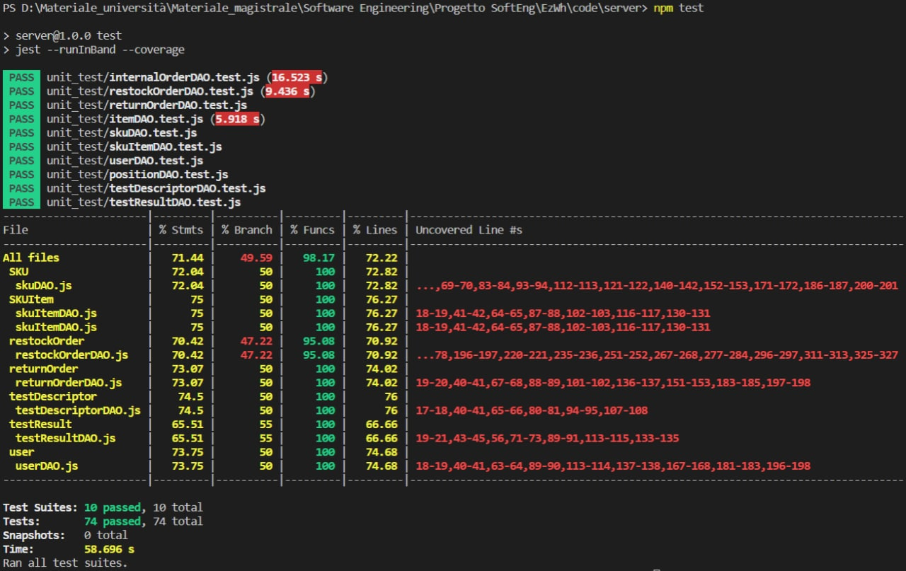

# Unit Testing Report

Date: 25/05/2022

Version: 2.0

# Contents

- [Black Box Unit Tests](#black-box-unit-tests)

- [White Box Unit Tests](#white-box-unit-tests)

# Black Box Unit Tests

    <Define here criteria, predicates and the combination of predicates for each function of each class.
    Define test cases to cover all equivalence classes and boundary conditions.
    In the table, report the description of the black box test case and (traceability) the correspondence with the Jest test case writing the 
    class and method name that contains the test case>
    <Jest tests  must be in code/server/unit_test  >

 ### **Class *skuDAO* - method *getSKUbyID***

 

**Criteria for method *getSKUbyID*:**
	

 - existence of a sku
 - number of skus
 - id

 

**Predicates for method *getSKUbyID*:**

| Criteria | Predicate |
| -------- | --------- |
|    existence of a sku      |   T        |
|          |         F  |
|     number of skus     |      0     |
|          |      1     |
|     id     |      null     |
|          |      not null     |

 

**Boundaries**:

| Criteria | Boundary values |
| -------- | --------------- |
|     existence of a sku      |                 |
|     number of skus     |      {min(0), max(1)}           |
|     id     |     {min(1), max(maxInt))}    |

 

**Combination of predicates**:

 

| existence of a sku | number of skus |id|  Valid / Invalid | Description of the test case | Jest test case |
|-------|-------|-------|-------|-------|-------|
|T|0|null|I|Impossible case because number of sku cannot be 0 if a sku exists|  |
|||not null|I|Impossible case because number of sku cannot be 0 if a sku exists||
||1|null|I|Error because id==null|newSKU(data); getSKUbyID(id)--> error|
|||not null|V||newSKU(data); getSKUbyID(id)--> SKU; SKU.length==1|
|F|0|null|V||newSKU(data); getSKUbyID(id)--> SKU; SKU.length==0|
|||not null|I|Error because there are no sku in the system| getSKUbyID(id)--> error|
||1|null|I|Impossible case because number of sku is 1 but no a sku exists|newSKU(data); getSKUbyID(id)--> error|
|||not null|I|Impossible case because number of sku is 1 but no a sku exists|newSKU(data); getSKUbyID(id)--> error|

Note: Before each test case a deleteAllSKUs() is runned

### ** skuDAO ** - method *newSKU***

 

**Criteria for method *newSKU*:**
	

 - SKU already exists
 - data is null or not

 

**Predicates for method *newSKU*:**

| Criteria | Predicate |
| -------- | --------- |
|    SKU already exists      |    T       |
|          |         F  |
|    data      |    null       |
|          |      not null     |

**Boundaries**:

| Criteria | Boundary values |
| -------- | --------------- |
|       SKU already exists     |                 |
|    data       |                 |

 

**Combination of predicates**:

 

| SKU already exists | data | Valid / Invalid | Description of the test case | Jest test case |
|-------|-------|-------|-------|-------|
|T|null|I|Failed because data==null|newSKU(data)-->error;|
||not null|I|Impossible case because SKU id is autoincremental|impossible case|
|F|null|I|Failed because data==null|newSKU(data)-->error;|
||not null|V||deleteAllSKUs(); newSKU(data); getStoredSKUS()-->SKUS; SKUS.length==1|

 

### **testDescriptorDAO** - method *newTestDescriptor***

 

**Criteria for method *newTestDescriptor*:**
	

 - testDescriptor already exists
 - data is null or not

**Predicates for method *newTestDescriptor*:**

| Criteria | Predicate |
| -------- | --------- |
|    testDescriptor already exists      |    T       |
|          |         F  |
|    data      |    null       |
|          |      not null     |

 

**Boundaries**:

| Criteria | Boundary values |
| -------- | --------------- |
|       testDescriptor already exists     |                 |
|    data       |                 |

 

**Combination of predicates**:

| testDescriptor already exists | data | Valid / Invalid | Description of the test case | Jest test case |
|-------|-------|-------|-------|-------|
|T|null|I|Failed because data==null|newTestDescriptor(data)-->error;|
||not null|I|Impossible case because newTestDescriptor id is autoincremental|impossible case|
|F|null|I|Failed because data==null|newTestDescriptor(data)-->error;|
||not null|V||deleteAllTestDescriptor(); newTestDescriptor(data); getTestDescriptors()-->TestDescriptors; TestDescriptors.length==1|

 

 ### **Class *testDescriptorDAO* - method *getTestDescriptorByID***

 

**Criteria for method *getTestDescriptorByID*:**
	

 - existence of a testDescriptor
 - number of testDescriptors
 - id

 

**Predicates for method *getTestDescriptorByID*:**

| Criteria | Predicate |
| -------- | --------- |
|    existence of a testDescriptor      |   T        |
|          |         F  |
|     number of testDescriptors     |      0     |
|          |      1     |
|     id     |      null     |
|          |      not null     |

 

**Boundaries**:

| Criteria | Boundary values |
| -------- | --------------- |
|     existence of a testDescriptor      |                 |
|     number of testDescriptors     |      {min(0), max(1)}           |
|     id     |     {min(1), max(maxInt))}    |

 

**Combination of predicates**:

 

| existence of a testDescriptor | number of testDescriptors |id|  Valid / Invalid | Description of the test case | Jest test case |
|-------|-------|-------|-------|-------|-------|
|T|0|null|I|Impossible case because number of testDescriptors cannot be 0 if a testDescriptor exists|  |
|||not null|I|Impossible case because number of testDescriptor cannot be 0 if a testDescriptor exists||
||1|null|I|Error because id==null|newTestDescriptor(data); getTestDescriptorByID(id)--> error|
|||not null|V||newTestDescriptor(data); getTestDescriptorByID(id)--> testDescriptor; testDescriptor.length==1|
|F|0|null|V||newTestDescriptor(data); getTestDescriptorByID(id)--> testDescriptor; testDescriptor.length==0|
|||not null|I|Error because there are no testDescriptor in the system| getTestDescriptorByID(id)--> error|
||1|null|I|Impossible case because number of testDescriptor is 1 but no a testDescriptor exists|newTestDescriptor(data); getTestDescriptorByID(id)--> error|
|||not null|I|Impossible case because number of testDescriptor is 1 but no a testDescriptor exists|newTestDescriptor(data); getTestDescriptorByID(id)--> error|

Note: Before each test case a deleteAllTestDescriptor() is runned

### **testResultDAO** - method *insertTestResult***

 

**Criteria for method *insertTestResult*:**
	

 - TestResult already exists
 - data is null or not

**Predicates for method *insertTestResult*:**

| Criteria | Predicate |
| -------- | --------- |
|    TestResult already exists      |    T       |
|          |         F  |
|    data      |    null       |
|          |      not null     |

 

**Boundaries**:

| Criteria | Boundary values |
| -------- | --------------- |
|       TestResult already exists     |                 |
|    data       |                 |

 

**Combination of predicates**:

| TestResult already exists | data | Valid / Invalid | Description of the test case | Jest test case |
|-------|-------|-------|-------|-------|
|T|null|I|Failed because data==null|insertTestResult((data)-->error;|
||not null|I|Impossible case because insertTestResult( id is autoincremental|impossible case|
|F|null|I|Failed because data==null|insertTestResult((data)-->error;|
||not null|V||deleteAllTestResult(); insertTestResult((data); getTestResults()-->TestResult; TestResult.length==1|

 

### **Class *testDescriptorDAO* - method *getTestResults***

 

**Criteria for method *getTestResults*:**
	

 - existence of a testResult
 - number of testResult
 - id

 

**Predicates for method *getTestResults*:**

| Criteria | Predicate |
| -------- | --------- |
|    existence of a testResult      |   T        |
|          |         F  |
|     number of testResult     |      0     |
|          |      1     |
|     id     |      null     |
|          |      not null     |

 

**Boundaries**:

| Criteria | Boundary values |
| -------- | --------------- |
|     existence of a testResult      |                 |
|     number of testResult     |      {min(0), max(1)}           |
|     id     |     {min(1), max(maxInt))}    |

 

**Combination of predicates**:

 

| existence of a testResult | number of testResult |id|  Valid / Invalid | Description of the test case | Jest test case |
|-------|-------|-------|-------|-------|-------|
|T|0|null|I|Impossible case because number of testResult cannot be 0 if a testResult exists|  |
|||not null|I|Impossible case because number of testResult cannot be 0 if a testResult exists||
||1|null|I|Error because id==null|insertTestResult(data); getTestResults(id)--> error|
|||not null|V||insertTestResult(data); getTestResults(id)--> testResult; testResult.length==1|
|F|0|null|V||insertTestResult(data); getTestResults(id)--> testResult; testResult.length==0|
|||not null|I|Error because there are no testResult in the system| getTestResults(id)--> error|
||1|null|I|Impossible case because number of testResult is 1 but no a testResult exists|insertTestResult(data); getTestResults(id)--> error|
|||not null|I|Impossible case because number of testResult is 1 but no a testResult exists|insertTestResult(data); getTestResults(id)--> error|

Note: Before each test case a deleteAllTestResult() is runned

### **Class *itemDAO* - method *getItem***

**Criteria for method *getItem*:**
	

 - existence of an item
 - number of items
 - id

**Predicates for method *getItem*:**

| Criteria | Predicate |
| -------- | --------- |
|    existence of an item      |   T        |
|          |         F  |
|     number of items    |      0     |
|          |      1     |
|     id     |      null     |
|          |      not null     |

**Boundaries**:

| Criteria | Boundary values |
| -------- | --------------- |
|     existence of an item      |                 |
|     number of items     |      {min(0), max(1)}           |
|     id     |     {min(1), max(maxInt))}    |

**Combination of predicates**:

| existence of an item | number of items |id|  Valid / Invalid | Description of the test case | Jest test case |
|-------|-------|-------|-------|-------|-------|
|T|0|null|I|Impossible case because number of item cannot be 0 if a item exists|  |
|||not null|I|Impossible case because number of item cannot be 0 if a item exists||
||1|null|I|Error because id==null|createItem(data); getItem(id)--> error|
|||not null|V||createItem(data); getItem(id)--> item; item.length==1|
|F|0|null|V||createItem(data); getItem(id)--> item; item.length==0|
|||not null|I|Error because there are no item in the system| getItem(id)--> error|
||1|null|I|Impossible case because number of item is 1 but no a item exists|createItem(data); getItem(id)--> error|
|||not null|I|Impossible case because number of item is 1 but no a item exists|createItem(data); getItem(id)--> error|

Note: Before each test case a deleteAllItems() is runned

### **itemDAO** - method *createItem*

**Criteria for method *createItem*:**
	

 - item already exists
 - data is null or not

**Predicates for method *createItem*:**

| Criteria | Predicate |
| -------- | --------- |
|    item already exists      |    T       |
|          |         F  |
|    data      |    null       |
|          |      not null     |

**Boundaries**:

| Criteria | Boundary values |
| -------- | --------------- |
|       item already exists     |                 |
|    data       |                 |

**Combination of predicates**:

| item already exists | data | Valid / Invalid | Description of the test case | Jest test case |
|-------|-------|-------|-------|-------|
|T|null|I|Failed because data==null|createItem(data)-->error;|
||not null|I|Failed because an item with the same ID already exists|createItem(data)-->error;|
|F|null|I|Failed because data==null|createItem(data)-->error;|
||not null|V||deleteAllItems(); createItem(data); getItems()-->items; items.length==1|

### **Class *positionDAO* - method *getPositionByID***

**Criteria for method *getPositionByID*:**
	

 - existence of a position
 - number of positions
 - id

**Predicates for method *getPositionByID*:**

| Criteria | Predicate |
| -------- | --------- |
|    existence of a position      |   T        |
|          |         F  |
|     number of positions     |      0     |
|          |      1     |
|     id     |      null     |
|          |      not null     |

**Boundaries**:

| Criteria | Boundary values |
| -------- | --------------- |
|     existence of a position      |                 |
|     number of positions     |      {min(0), max(1)}           |
|     id     |     isString()    |

**Combination of predicates**:

| existence of a position | number of positions |id|  Valid / Invalid | Description of the test case | Jest test case |
|-------|-------|-------|-------|-------|-------|
|T|0|null|I|Impossible case because number of position cannot be 0 if a position exists|  |
|||not null|I|Impossible case because number of position cannot be 0 if a position exists||
||1|null|I|Error because id==null|insertPosition(data); getPositionByID(id)--> error|
|||not null|V||insertPosition(data); getPositionByID(id)--> position; position.length==1|
|F|0|null|V||insertPosition(data); getPositionByID(id)--> position; position.length==0|
|||not null|I|Error because there are no position in the system| getPositionByID(id)--> error|
||1|null|I|Impossible case because number of position is 1 but no a position exists|insertPosition(data); getPositionByID(id)--> error|
|||not null|I|Impossible case because number of position is 1 but no a position exists|insertPosition(data); getPositionByID(id)--> error|

Note: Before each test case a deleteAllPositions() is runned

### **positionDAO** - method *insertPosition*

**Criteria for method *insertPosition*:**
	

 - position already exists
 - data is null or not

**Predicates for method *insertPosition*:**

| Criteria | Predicate |
| -------- | --------- |
|    position already exists      |    T       |
|          |         F  |
|    data      |    null       |
|          |      not null     |

**Boundaries**:

| Criteria | Boundary values |
| -------- | --------------- |
|       position already exists     |                 |
|    data       |                 |

**Combination of predicates**:

| position already exists | data | Valid / Invalid | Description of the test case | Jest test case |
|-------|-------|-------|-------|-------|
|T|null|I|Failed because data==null|insertPosition(data)-->error;|
||not null|I|Failed because a position with the same ID already exists|insertPosition(data)-->error;|
|F|null|I|Failed because data==null|insertPosition(data)-->error;|
||not null|V||deleteAllPositions(); newSKU(data); getPositions()-->positions; positions.length==1|

 ### **Class *skuItemDAO* - method *getSKUItemsByRFID***

**Criteria for method *getSKUItemsByRFID*:**
	

 - existence of a SKUItem
 - number of SKUItems
 - RFID

**Predicates for method *getSKUItemsByRFID*:**

| Criteria | Predicate |
| -------- | --------- |
|    existence of a SKUItem      |   T        |
|          |         F  |
|     number of SKUItems     |      0     |
|          |      1     |
|     RFID     |      null     |
|          |      not null     |

**Boundaries**:

| Criteria | Boundary values |
| -------- | --------------- |
|     existence of a SKUItem      |                 |
|     number of SKUItems     |      {min(0), max(1)}           |
|     RFID     |     isString()    |

**Combination of predicates**:

| existence of a SKUItem | number of SKUItems |RFID|  Valid / Invalid | Description of the test case | Jest test case |
|-------|-------|-------|-------|-------|-------|
|T|0|null|I|Impossible case because number of SKUItem cannot be 0 if a SKUItem exists|  |
|||not null|I|Impossible case because number of SKUItem cannot be 0 if a SKUItem exists||
||1|null|I|Error because RFID==null|newSKUItem(data); getSKUItemsByRFID(RFID)--> error|
|||not null|V||newSKUItem(data); getSKUItemsByRFID(RFID)--> SKUItem; SKUItem.length==1|
|F|0|null|V||newSKUItem(data); getSKUItemsByRFID(RFID)--> SKUItem; SKUItem.length==0|
|||not null|I|Error because there are no SKUItem in the system| getSKUItemsByRFID(RFID)--> error|
||1|null|I|Impossible case because number of SKUItem is 1 but no a SKUItem exists|newSKUItem(data); getSKUItemsByRFID(RFID)--> error|
|||not null|I|Impossible case because number of SKUItem is 1 but no a SKUItem exists|newSKUItem(data); getSKUItemsByRFID(RFID)--> error|

Note: Before each test case a deleteAllSKUItems() is runned

### **skuItemDAO** - method *newSKUItem*

**Criteria for method *newSKUItem*:**
	

 - SKUItem already exists
 - data is null or not

**Predicates for method *newSKUItem*:**

| Criteria | Predicate |
| -------- | --------- |
|    SKUItem already exists      |    T       |
|          |         F  |
|    data      |    null       |
|          |      not null     |

**Boundaries**:

| Criteria | Boundary values |
| -------- | --------------- |
|       SKUItem already exists     |                 |
|    data       |                 |

**Combination of predicates**:

| SKUItem already exists | data | Valid / Invalid | Description of the test case | Jest test case |
|-------|-------|-------|-------|-------|
|T|null|I|Failed because data==null|newSKUItem(data)-->error;|
||not null|I|Failed because a SKUItem with the same RFID is already exists|impossible case|
|F|null|I|Failed because data==null|newSKUItem(data)-->error;|
||not null|V||deleteAllSKUItems(); newSKUItem(data); getSKUItemsByRFID()-->SKUItems; SKUItems.length==1|

### **Class *userDAO* - method *getUserbyUsername***

**Criteria for method *getUserbyUsername*:**
	

 - existence of an account
 - number of accounts
 - username

**Predicates for method *getUserbyUsername*:**

| Criteria | Predicate |
| -------- | --------- |
|    existence of a account      |   T        |
|          |         F  |
|     number of accounts     |      0     |
|          |      1     |
|     username     |      null     |
|          |      not null     |

**Boundaries**:

| Criteria | Boundary values |
| -------- | --------------- |
|     existence of a account      |                 |
|     number of accounts     |      {min(0), max(1)}           |
|     username     |     isString()    |

**Combination of predicates**:

| existence of a account | number of accounts |username|  Valid / Invalid | Description of the test case | Jest test case |
|-------|-------|-------|-------|-------|-------|
|T|0|null|I|Impossible case because number of user cannot be 0 if a user exists|  |
|||not null|I|Impossible case because number of user cannot be 0 if a user exists||
||1|null|I|Error because username==null|newUser(data); getUserbyUsername(username)--> error|
|||not null|V||newUser(data); getUserbyUsername(username)--> user; user.length==1|
|F|0|null|V||newUser(data); getUserbyUsername(username)--> user; user.length==0|
|||not null|I|Error because there are no user in the system| getUserbyUsername(username)--> error|
||1|null|I|Impossible case because number of user is 1 but no a user exists|newUser(data); getUserbyUsername(username)--> error|
|||not null|I|Impossible case because number of user is 1 but no a user exists|newUser(data); getUserbyUsername(username)--> error|

Note: Before each test case a deleteAllUsersTest() is runned

### **userDAO** - method *newUser*

**Criteria for method *newUser*:**
	

 - account already exists
 - data is null or not

**Predicates for method *newUser*:**

| Criteria | Predicate |
| -------- | --------- |
|    account already exists      |    T       |
|          |         F  |
|    data      |    null       |
|          |      not null     |

**Boundaries**:

| Criteria | Boundary values |
| -------- | --------------- |
|       account already exists     |                 |
|    data       |                 |

**Combination of predicates**:

| account already exists | data | Valid / Invalid | Description of the test case | Jest test case |
|-------|-------|-------|-------|-------|
|T|null|I|Failed because data==null|newUser(data)-->error;|
||not null|I|Impossible case because account id is autoincremental|impossible case|
|F|null|I|Failed because data==null|newUser(data)-->error;|
||not null|V||deleteAllAccounts(); newUser(data); getStoredUsers()-->accounts; accounts.length==1|

### **restockOrderDAO** - method *createRestockOrder*

**Criteria for method *createRestockOrder*:**
	

 - restockOrder already exists
 - data is null or not

**Predicates for method *createRestockOrder*:**

| Criteria | Predicate |
| -------- | --------- |
|    restockOrder already exists      |    T       |
|          |         F  |
|    data      |    null       |
|          |      not null     |

**Boundaries**:

| Criteria | Boundary values |
| -------- | --------------- |
|       restockOrder already exists     |                 |
|    data       |                 |

**Combination of predicates**:

| restockOrder already exists | data | Valid / Invalid | Description of the test case | Jest test case |
|-------|-------|-------|-------|-------|
|T|null|I|Failed because data==null|createRestockOrder(data)-->error;|
||not null|I|Impossible case because restockOrder id is autoincremental|impossible case|
|F|null|I|Failed because data==null|createRestockOrder(data)-->error;|
||not null|V||deleteAllRestockOrders(); createRestockOrder(data); getRestockOrders()-->restockOrder; restockOrder.length==1|

### **Class *restockOrderDAO* - method *createRestockOrder***

**Criteria for method *createRestockOrder*:**
	

 - existence of an restockOrder
 - number of restockOrders
 - id

**Predicates for method *createRestockOrder*:**

| Criteria | Predicate |
| -------- | --------- |
|    existence of a restockOrder      |   T        |
|          |         F  |
|     number of restockOrders     |      0     |
|          |      1     |
|     id     |      null     |
|          |      not null     |

**Boundaries**:

| Criteria | Boundary values |
| -------- | --------------- |
|     existence of a restockOrder      |                 |
|     number of restockOrders     |      {min(0), max(1)}           |
|     id     |         |

**Combination of predicates**:

| existence of a restockOrder | number of restockOrders |id|  Valid / Invalid | Description of the test case | Jest test case |
|-------|-------|-------|-------|-------|-------|
|T|0|null|I|Impossible case because number of restockOrder cannot be 0 if a restockOrder exists|  |
|||not null|I|Impossible case because number of restockOrder cannot be 0 if a restockOrder exists||
||1|null|I|Error because id==null|createRestockOrder(data); getRestockOrder(id)--> error|
|||not null|V||createRestockOrder(data); getRestockOrder(id)--> restockOrder; restockOrder.length==1|
|F|0|null|V||createRestockOrder(data); getRestockOrder(id)--> restockOrder; restockOrder.length==0|
|||not null|I|Error because there are no restockOrder in the system| getRestockOrder(id)--> error|
||1|null|I|Impossible case because number of restockOrder is 1 but no a restockOrder exists|createRestockOrder(data); getRestockOrder(id)--> error|
|||not null|I|Impossible case because number of restockOrder is 1 but no a restockOrder exists|createRestockOrder(data); getRestockOrder(id)--> error|

Note: Before each test case a deleteAllRestockOrders() is runned

### **Class *internalOrderDAO* - method *getInternalOrderById***

**Criteria for method *getInternalOrderById*:**
	

 - existence of a internal order
 - number of internal orders
 - id

**Predicates for method *getInternalOrderById*:**

| Criteria | Predicate |
| -------- | --------- |
|    existence of a internal order      |   T        |
|          |         F  |
|     number of internal orders     |      0     |
|          |      1     |
|     id     |      null     |
|          |      not null     |

**Boundaries**:

| Criteria | Boundary values |
| -------- | --------------- |
|     existence of a internal order      |                 |
|     number of internal orders     |      {min(0), max(1)}           |
|     id     |     {min(1), max(maxInt))}    |

**Combination of predicates**:

| existence of a internal order | number of internal orders |id|  Valid / Invalid | Description of the test case | Jest test case |
|-------|-------|-------|-------|-------|-------|
|T|0|null|I|Impossible case because number of internal order cannot be 0 if a internal order exists|  |
|||not null|I|Impossible case because number of internal order cannot be 0 if a internal order exists||
||1|null|I|Error because id==null|newInternalOrder(data); getInternalOrderById(id)--> error|
|||not null|V||newInternalOrder(data); getInternalOrderById(id)--> internalOrder; internalOrder.length==1|
|F|0|null|V||newInternalOrder(data); getInternalOrderById(id)--> internalOrder; internalOrder.length==0|
|||not null|I|Error because there are no internal order in the system| getInternalOrderById(id)--> error|
||1|null|I|Impossible case because number of internal order is 1 but no a internal order exists|newInternalOrder(data); getInternalOrderById(id)--> error|
|||not null|I|Impossible case because number of internal order is 1 but no a internal order exists|newInternalOrder(data); getInternalOrderById(id)--> error|

Note: Before each test case a deleteAllInternalOrders() is runned

### **internalOrderDAO** - method *newInternalOrder*

**Criteria for method *newInternalOrder*:**
	

 - Internal order already exists
 - data is null or not

**Predicates for method *newInternalOrder*:**

| Criteria | Predicate |
| -------- | --------- |
|    Internal order already exists      |    T       |
|          |         F  |
|    data      |    null       |
|          |      not null     |

**Boundaries**:

| Criteria | Boundary values |
| -------- | --------------- |
|       Internal order already exists     |                 |
|    data       |                 |

**Combination of predicates**:

| Internal order already exists | data | Valid / Invalid | Description of the test case | Jest test case |
|-------|-------|-------|-------|-------|
|T|null|I|Failed because data==null|newInternalOrder(data)-->error;|
||not null|I|Impossible case because internal order id is autoincremental|impossible case|
|F|null|I|Failed because data==null|newInternalOrder(data)-->error;|
||not null|V||deleteAllInternalOrders(); newInternalOrder(data); getInternalOrders()-->internalOrders; internalOrders.length==1|

### **returnOrderDAO** - method *newReturnOrder*

**Criteria for method *newReturnOrder*:**
	

 - return order already exists
 - data is null or not

**Predicates for method *newReturnOrder*:**

| Criteria | Predicate |
| -------- | --------- |
|    return order already exists      |    T       |
|          |         F  |
|    data      |    null       |
|          |      not null     |

**Boundaries**:

| Criteria | Boundary values |
| -------- | --------------- |
|       return order already exists     |                 |
|    data       |                 |

**Combination of predicates**:

| return order already exists | data | Valid / Invalid | Description of the test case | Jest test case |
|-------|-------|-------|-------|-------|
|T|null|I|Failed because data==null|newReturnOrder(data)-->error;|
||not null|I|Impossible case because internal order id is autoincremental|impossible case|
|F|null|I|Failed because data==null|newReturnOrder(data)-->error;|
||not null|V||deleteAllReturnOrders(); newReturnOrder(data); getInternalOrders()-->returnOrders; returnOrders.length==1|

### **Class *returnOrderDAO* - method *getReturnOrderById***

**Criteria for method *getReturnOrderById*:**
	

 - existence of a return order
 - number of return orders
 - id

**Predicates for method *getReturnOrderById*:**

| Criteria | Predicate |
| -------- | --------- |
|    existence of a return order      |   T        |
|          |         F  |
|     number of return orders     |      0     |
|          |      1     |
|     id     |      null     |
|          |      not null     |

**Boundaries**:

| Criteria | Boundary values |
| -------- | --------------- |
|     existence of a return order      |                 |
|     number of return orders     |      {min(0), max(1)}           |
|     id     |     {min(1), max(maxInt))}    |

**Combination of predicates**:

| existence of a return order | number of return orders |id|  Valid / Invalid | Description of the test case | Jest test case |
|-------|-------|-------|-------|-------|-------|
|T|0|null|I|Impossible case because number of return order cannot be 0 if a return order exists|  |
|||not null|I|Impossible case because number of return order cannot be 0 if a return order exists||
||1|null|I|Error because id==null|newReturnOrder(data); getReturnOrderById(id)--> error|
|||not null|V||newReturnOrder(data); getReturnOrderById(id)--> returnOrder; returnOrder.length==1|
|F|0|null|V||newReturnOrder(data); getReturnOrderById(id)--> returnOrder; returnOrder.length==0|
|||not null|I|Error because there are no return order in the system| getReturnOrderById(id)--> error|
||1|null|I|Impossible case because number of return order is 1 but no a return order exists|newReturnOrder(data); getReturnOrderById(id)--> error|
|||not null|I|Impossible case because number of return order is 1 but no a return order exists|newReturnOrder(data); getReturnOrderById(id)--> error|

Note: Before each test case a deleteAllReturnOrders() is runned

# White Box Unit Tests

### Test cases definition
    
    
    <Report here all the created Jest test cases, and the units/classes under test >
    <For traceability write the class and method name that contains the test case>

| Unit name | Jest test case |
|--|--|
|internalOrderDAO.test.js|
||getInternalOrdersTest()|
||getInternalOrderByIdTest()|
||getInternalOrderByStateTest()|
||getProductsOfInternalOrderTest()|
||getProductsOfInternalOrderCompletedTest()
||checkAvaiabilityOfSKUForInternalOrderTest()
||getLastIdOfInternalOrdersTest()
||decreaseQuantityOfSKUForInternalOrderTest()
||increaseQuantityOfSKUForInternalOrderTest()
||getPositionIdBySKUIdTest()
||updateInternalOrderIdOfSKUItemTest()
||deleteInternalOrderTest()
||newInternalOrder_SKUTest()
||deleteInternalOrder_SKUByIdTest()
||decreasePositionInternalOrderTest()
||increasePositionInternalOrderTest()
||updateInternalOrderTest()
||deleteInternalOrder_SKUTest()
||deleteInternalOrder_SKUITEMTest()
|itemDAO.test.js|
||deleteAllItemsTest()|
||newItemTest()
||getItembySKUIDTest()
||updateItemTest()
||deleteItemTest()
|positionDAO.test.js|
||getInternalOrdersTest()|
||deleteAllPositionsTest()
||getPositionsTest()
||getPositionByIDTest()
||newPositionTest()
||updatePositionTest()
||modifyPosition()
||deletePositionTest()
|restockOrderDAO.test.js
||deleteAllRestockOrdersTest()|
||deleteRestockOrderTest()
||newRestockOrderTest()
||getProductsOfRestockOrderTest()
||getRestockOrderByIdTest()
||getSKUItemsOfRestockOrderTest()
||getRestockOrdersISSUED()
||returnItemTest()
||modifyNoteTest()
|returnOrderDAO.test.js|
||deleteAllReturnOrderTest()
||createReturnOrder()
|skuDAO.test.js|
||deleteAllSKUsTest()|
||newSKUTest()
||getSKUbyIDTest()
||updateSKUTest()
||updateSKUwPosositionTest()
||deleteSKUTest()
|skuItemDAO.test.js|
||deleteAllSKUsTest()|
||deleteAllSkuItemTest()
||insertSkuItem()
||modifyRFID()
||getSKUItemsTest()
||getSKUItemsBySKUIDTest()
||getSKUItemsByRFIDTest()
||deleteSkuItemTest()
|testDescriptorDAO.test.js|
||deleteAllTestDescriptorTest()|
||newTestDescriptorTest()
||getTestDescriptorbyIDTest()
||updateTestDescriptorTest()
||deleteTestDescriptorTest()
|testResultDAO.test.js|
||deleteAllTestResultTest()|
||newTestResultTest()
||getTestResultbyIDTest()
||updateTestResultTest()
||deleteTestResultTest()
|userDAO.test.js|
||deleteAllUsersTest()|
||newUserTest()
||getSuppliersTest()
||getStoredUsersTest()
||getUserbyUsernameAndTypeTest()
||updateRightsTest()
||deleteUserTest()

### Code coverage report

    <Add here the screenshot report of the statement and branch coverage obtained using
    the coverage tool. >

### Loop coverage analysis

    <Identify significant loops in the units and reports the test cases
    developed to cover zero, one or multiple iterations >

|Unit name | Loop rows | Number of iterations | Jest test case |
|---|---|---|---|
|||||
|||||
||||||

